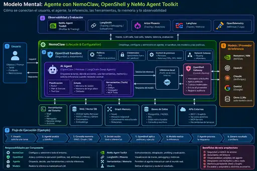
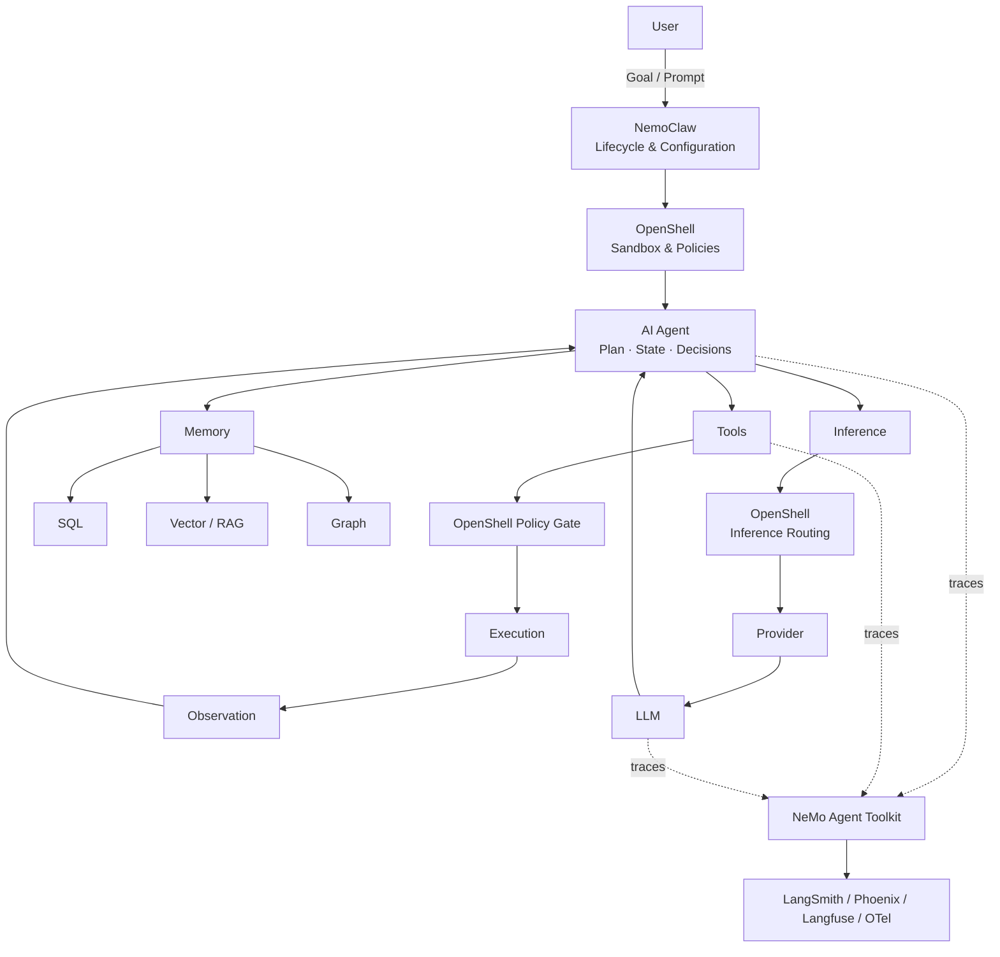

# Agent Mental Model — NemoClaw, OpenShell, NeMo Agent Toolkit

**ID:** NVIDIA-AGENT-MENTAL-MODEL-ARTIFACT-001  
**Version:** 0.1  
**Status:** DRAFT  
**Date:** 2026-09-30  
**Contract:** [AGENT_MENTAL_MODEL_CONTRACT_v0.1](../../governance/AGENT_MENTAL_MODEL_CONTRACT_v0.1.md)

## Purpose

This artifact preserves the project's mental model for understanding the relationships among the user, NemoClaw, OpenShell, the AI agent, tools, memory, model inference, NeMo Agent Toolkit, and observability.

The artifact is educational and architectural. It captures the current project interpretation and is intentionally kept separate from vendor-source validation.

## Visual artifact



## 1. User

The user:

```text
defines objective
defines task
provides context
establishes restrictions
receives result
```

Input:

```text
Prompt / Request
```

Output:

```text
Response
Artifact
Task result
```

## 2. NemoClaw — lifecycle and configuration

Primary mental-model function:

```text
configure
deploy
manage
version
coordinate
```

Conceptual position:

```text
NemoClaw
├── configures Agent
├── configures OpenShell
├── configures Provider
├── configures Policies
├── configures Credentials
└── manages Lifecycle
```

Mental shortcut:

```text
NemoClaw = assembler + lifecycle manager
```

NemoClaw is not the model performing neural inference.

## 3. OpenShell — security and execution boundary

OpenShell forms the security boundary around execution.

```text
OpenShell
├── Sandbox
├── Policy Engine
├── Network Gateway
├── Credential Management
├── Filesystem Control
├── Process Control
└── Inference Routing
```

It answers questions such as:

```text
What may the agent do?
What may it execute?
What may it read/write?
Where may it connect?
Which credentials may it use?
Which model/provider may it reach?
```

Simplified policy flow:

```text
Agent attempts action
        │
        ▼
    OpenShell
        │
   policy check
     /      \
  allow     deny
    │
    ▼
 execution
```

## 4. AI Agent

The agent orchestrates the task.

Possible agent runtimes/frameworks in the broader learning model can include OpenClaw, Hermes, LangGraph-based agents, Deep Agents, or another compatible runtime.

Conceptually:

```text
                 AGENT
                   │
        ┌──────────┼──────────┐
        ▼          ▼          ▼
    Planning     State       Tools
        │          │          │
        ▼          ▼          ▼
    Decisions    Memory     Actions
```

Responsibilities:

```text
understand objective
plan
maintain state
decide next action
consult memory
use tools
request inference
process observations
determine when task is complete
```

Agent loop:

```text
observe
   ↓
reason
   ↓
decide
   ↓
act
   ↓
observe
   ↓
...
```

## 5. Tools

Tools are operational capabilities available to the agent.

```text
TOOLS
├── shell
├── Git
├── filesystem
├── browser
├── APIs
├── MCP
├── Python
├── database queries
└── custom functions
```

Typical tool flow:

```text
Agent identifies a needed action
        ↓
Agent selects tool
        ↓
OpenShell checks policy
        ↓
Tool executes
        ↓
Observation
        ↓
Agent
```

A tool invocation can execute without an additional LLM inference call.

## 6. Memory

Memory should not be visualized as one database.

```text
MEMORY
├── Session / Working Memory
├── Structured Memory
├── Semantic Memory
├── Relational Memory
└── Artifact / Persistent Memory
```

Technical view:

```text
                 MEMORY
                   │
       ┌───────────┼───────────┐
       ▼           ▼           ▼
      SQL       Vector DB     Graph
       │           │           │
   records      semantic    relations
                 search
```

### 6.1 SQL / structured memory

Examples: PostgreSQL, MySQL, SQLite.

Typical uses:

```text
state
users
transactions
jobs
configuration
metadata
structured facts
```

### 6.2 Vector / RAG memory

Examples used for learning may include FAISS, Milvus, Qdrant, pgvector, and NeMo Retriever.

```text
Question
   ↓
Embedding
   ↓
Vector Search
   ↓
Top-K chunks
   ↓
Context
   ↓
Agent / LLM
```

### 6.3 Graph memory

A graph represents entities and relationships.

```text
ENTITY
   │
RELATIONSHIP
   │
ENTITY
```

Example:

```text
Project
  ├── USES ───────► NemoClaw
  ├── RUNS_ON ────► GCP
  └── DEPENDS_ON ─► OpenShell
```

This is conceptually different from semantic document similarity search.

## 7. Model / inference provider

The model/provider performs LLM inference.

Examples in the learning ecosystem may include Nemotron/NVIDIA NIM, OpenAI models, Claude, Gemini, or other providers.

```text
Agent
  │ inference request
  ▼
OpenShell
  │ route / policy / credentials
  ▼
Provider
  ▼
Model
  │ inference
  ▼
Response
  ▼
Agent
```

The model normally does not itself own Git, filesystem, database, browser, or business workflow execution. Those capabilities belong to the agent/tool system.

## 8. NeMo Agent Toolkit

NeMo Agent Toolkit is represented as a separate, cross-cutting engineering layer.

```text
NeMo Agent Toolkit
├── integration
├── instrumentation
├── profiling
├── evaluation
├── workflows
└── observability hooks
```

Conceptual relationship:

```text
              NeMo Agent Toolkit
                     │
         ┌───────────┼──────────┐
         ▼           ▼          ▼
       Agent       Tools       LLM
         │           │          │
         └──────── traces ──────┘
```

## 9. Observability

Examples:

```text
LangSmith
Phoenix
Langfuse
OpenTelemetry
```

They can receive:

```text
trace
span
LLM call
tool call
token usage
latency
errors
metadata
evaluation results
```

Mental model:

```text
Agent
 ├── LLM call ───────┐
 ├── Tool call ──────┤
 ├── RAG query ──────┤
 └── DB query ───────┤
                     ▼
                   TRACE
                     │
                     ▼
               Observability
```

## 10. Global mental-model schema



Text equivalent:

```text
                         USER
                          │
                    Goal / Prompt
                          │
                          ▼
               ┌───────────────────┐
               │     NemoClaw      │
               │ configuration     │
               │ lifecycle         │
               └─────────┬─────────┘
                         │
                         ▼
              ┌─────────────────────┐
              │      OpenShell      │
              │ Sandbox + Policies  │
              └─────────┬───────────┘
                        │
                        ▼
                 ┌─────────────┐
                 │   AI AGENT  │
                 │ plan/state  │
                 │ decisions   │
                 └──────┬──────┘
                        │
          ┌─────────────┼─────────────┐
          ▼             ▼             ▼
        TOOLS          MEMORY      INFERENCE
          │             │             │
    Git/API/MCP    SQL/Vector/Graph   ▼
                                 OpenShell
                                     │
                                  Provider
                                     │
                                    LLM
```

Parallel observability path:

```text
EXECUTION
    │
    ▼
NeMo Agent Toolkit
    │
    ▼
telemetry / traces
    │
    ├── LangSmith
    ├── Phoenix
    ├── Langfuse
    └── OpenTelemetry
```

## 11. Complete execution flow

```text
01 USER
   │ "perform this task"
   ▼
02 AGENT receives objective
   ▼
03 AGENT loads state/context
   ▼
04 AGENT consults memory
   ├── SQL
   ├── Vector RAG
   └── Graph
   ▼
05 AGENT evaluates information
   ▼
06 Does it need reasoning/inference?
       │
    ┌──┴───┐
   YES     NO
    │       │
    ▼       │
07 inference
    │       │
 OpenShell  │
    │       │
 Provider   │
    │       │
   LLM      │
    │       │
 response   │
    └───┬───┘
        ▼
08 AGENT decides action
        ▼
09 TOOL REQUEST
        ▼
10 OpenShell Policy Check
       / \
   ALLOW  DENY
     │      │
     ▼      ▼
 execute   error
     │
     ▼
11 Observation
     └────────────► Agent loop

12 Goal == COMPLETE
        │
        ▼
      OUTPUT
        │
        ▼
     ARTIFACT
        │
        ▼
       USER
```

## 12. Three interconnected loops

### 12.1 Agent loop

```text
              ┌───────────────────┐
              │                   │
              ▼                   │
         OBSERVATION              │
              ▼                   │
            STATE                 │
              ▼                   │
            REASON                │
              ▼                   │
           DECISION               │
       ┌──────┼───────┐           │
       ▼      ▼       ▼           │
    TOOL   MEMORY  INFERENCE      │
       └──────┴───────┘           │
              ▼                   │
            ACTION                │
              └───────────────────┘
```

### 12.2 Security loop

```text
REQUEST
   ↓
IDENTIFY
   ↓
POLICY
   ↓
ALLOW / DENY
   ↓
EXECUTE
   ↓
AUDIT
```

Relationship:

```text
        AGENT LOOP
           │
Think → Decide → Act
           │
           ▼
      SECURITY LOOP
           │
Request → Policy → Execution
```

### 12.3 Observability loop

```text
execution
    ↓
trace
    ↓
metrics
    ↓
evaluation
    ↓
analysis
    ↓
improvement
    ↓
new version
```

Combined mental model:

```text
               ┌─────────────────────┐
               │     AGENT LOOP      │
               │ Observe             │
               │ Reason              │
               │ Decide              │
               │ Act                 │
               └──────────┬──────────┘
                          ▼
               ┌─────────────────────┐
               │   SECURITY LOOP     │
               │ Request             │
               │ Policy              │
               │ Allow / Deny        │
               │ Execute             │
               └──────────┬──────────┘
                          ▼
               ┌─────────────────────┐
               │ OBSERVABILITY LOOP  │
               │ Trace               │
               │ Measure             │
               │ Evaluate            │
               │ Improve             │
               └─────────────────────┘
```

## 13. Core takeaway

The canonical project mental model is:

> **Agent Loop + Security Loop + Observability Loop**, supported by **Memory + Tools + Inference**, and managed through **Lifecycle / Configuration**.

This distinction is the foundation for future labs on sandbox design, agent containers, RAG/graph memory, inference routing, tool policies, and agent observability.

## 14. Status and validation note

This artifact is **DRAFT** because it preserves and structures the current project mental model. Promotion to **VALIDATED** requires explicit comparison against current official documentation and evidence for any product-specific behavior.
## 15. Visual resolution profile

The current V1 and V2 PNG/WebP visual assets are verified at **512 × 341 px**. This is the current raster baseline and preview resolution.

The project resolution recommendation is:

| Profile | Resolution | Use |
|---|---:|---|
| Preview | 512 × 341 | GitHub/web lightweight preview |
| Documentation | 1024 × 682 | Docs, PDF and presentations |
| Master PNG | 2048 × 1364 | High-resolution canonical raster target |

The aspect ratio is locked. Cropping, stretching and generative reinterpretation are not permitted as resolution-conversion methods. Because the current raster baseline is only 512 × 341, deterministic upscaling preserves design but does not add true source detail. A future true master should preferably be rendered natively from an approved editable/vector source.

Normative reference: `governance/VISUAL_RESOLUTION_STANDARD_v0.1.md`.

